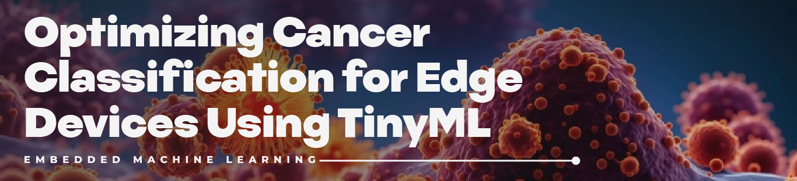

# **Optimizing Cancer Classification for Edge Devices Using TinyML**

## 📌 **Project Overview**
This project focuses on building a low-power, real-time cancer classification system using **TinyML** and deploying it on an **Arduino Nano** microcontroller. By leveraging RNA-Seq gene expression data, the project demonstrates how high-dimensional biomedical data can be preprocessed, analyzed, and modeled to predict different types of cancer. The final model is optimized and converted into a lightweight format suitable for embedded environments.

---

## 🧬 **Dataset Description**

The dataset contains **gene expression levels** for thousands of genes measured using the **Illumina HiSeq platform**. Each row represents a biological sample, and each column corresponds to a specific gene. A separate file provides **cancer type labels** for each sample.

- **Number of Samples**: Rows in the dataset represent unique patient samples.
- **Number of Features**: 20,531 gene expression attributes (gene_0 to gene_20530).
- **Classes**: 
  - **`PRAD`**: Prostate Adenocarcinoma  
  - **`LUAD`**: Lung Adenocarcinoma  
  - **`BRCA`**: Breast Cancer  
  - **`KIRC`**: Kidney Renal Clear Cell Carcinoma  
  - **`COAD`**: Colon Adenocarcinoma  

For more details, refer to the original submission on [**`Synapse`**](https://www.synapse.org/#!Synapse:syn4301332).

---

## ⚙️ **Project Pipeline**

1. **Data Preprocessing**
   - Sample identifier column renamed for clarity.
   - Missing values handled and exploratory analysis performed.
   - Data normalization and scaling.
   - Feature selection using **`XGBoost`**.

2. **Model Building**
   - Multiple classification models tested (e.g., Logistic Regression, Random Forest, Neural Networks).
   - Model performance evaluated using accuracy, F1-score, and confusion matrix.

3. **TinyML Optimization**
   - Best-performing model selected and optimized.
   - Model re-written in **`Embedded C`** for implementing in **`Arduino NANO`**.

4. **Deployment**
   - Final model deployed on an **Arduino Nano**.
   - Real-time inference tested on embedded hardware.

---

## 🎯 **Project Aim**

The main goal is to **deploy a cancer classification model** onto a resource-constrained device like Arduino Nano, thereby showcasing how **TinyML** can be applied to real-world biomedical problems. This approach enables **low-latency, energy-efficient, and privacy-preserving** diagnostic tools for areas with limited access to healthcare infrastructure.

---

## ✅ **Benefits of TinyML Implementation**

- **Portability**: Enables deployment in remote or resource-limited environments.
- **Low Power Consumption**: Ideal for long-term deployment in wearable or battery-powered devices.
- **Real-time Inference**: Makes instant prediction possible without relying on cloud services.
- **Data Privacy**: No external transmission required; data is processed locally on the device.

---

## 🛠️ **Tools and Libraries Used**

- **Python** (for data processing and model training)
- **scikit-learn**, **Pandas**, **NumPy**, **Matplotlib**
- **TensorFlow / TensorFlow Lite**
- **Arduino IDE** for deployment
- **Edge Impulse / PlatformIO** (optional for deployment workflow)

---

## 🚀 **How to Run the Project**

1. Clone the repository  
2. Preprocess the dataset (`.ipynb` notebook provided)  
3. Train and evaluate classification models  
4. Optimize the model for TinyML  
5. Deploy using Arduino IDE or PlatformIO

---

## 📂 **Repository Structure**

- **`notebooks/`** – Data exploration and model training notebooks  
- **`models/`** – Trained and quantized model files  
- **`nano/`** – Arduino Nano deployment code and TFLite model  
- **`data/`** – Dataset files **`[download from links provided]`**  
- **`README.md`** – Project documentation  

---

## 🧠 **Future Work**

- Integrate feature selection using advanced techniques (e.g., SHAP values, Recursive Feature Elimination).
- Experiment with lightweight neural architectures like **`SNN`** or **`MobileNet`**.
- Real-time testing using new biological samples.
- Integrate BLE communication for remote monitoring.

---

## 📜 **License**

This project is licensed under the MIT License.

---

## 🙌 **Acknowledgements**

- Dataset provided via [**`Synapse TCGA PanCan Atlas`**](https://www.synapse.org/#!Synapse:syn4301332).
- Inspired by the growing field of **TinyML** and its applications in **precision medicine**.
